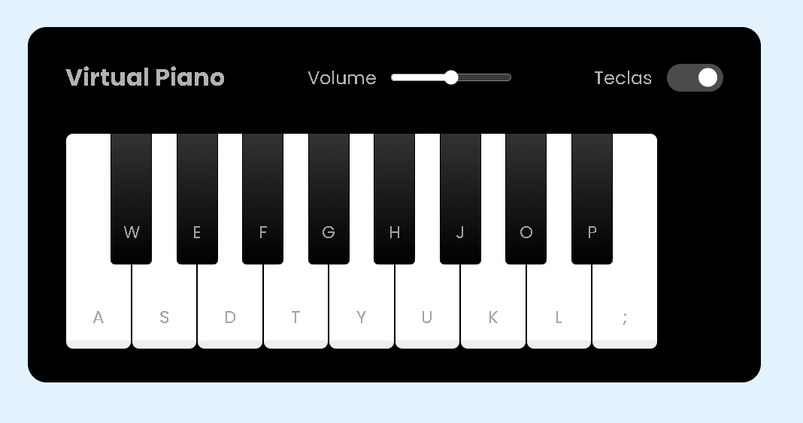

# dio-piano

Construido um simulador de piano totalmente funcional no navegador.
Utilizado HTML, CSS e o poder de manipulação da D.O.M. do Browser através de Javascript e claro realizado interações com áudio.

